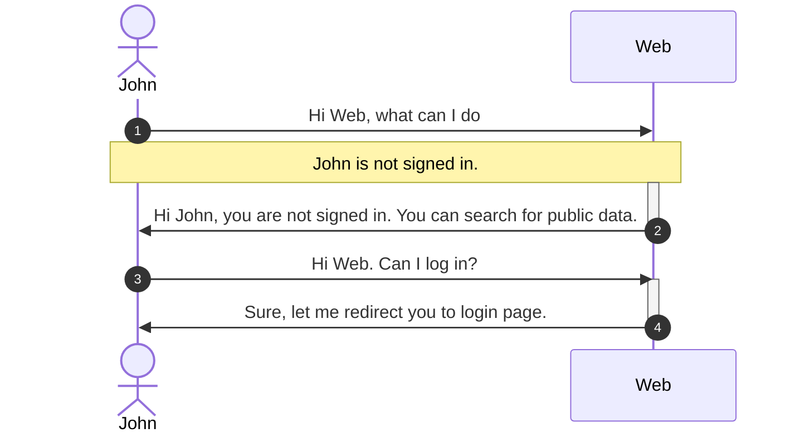
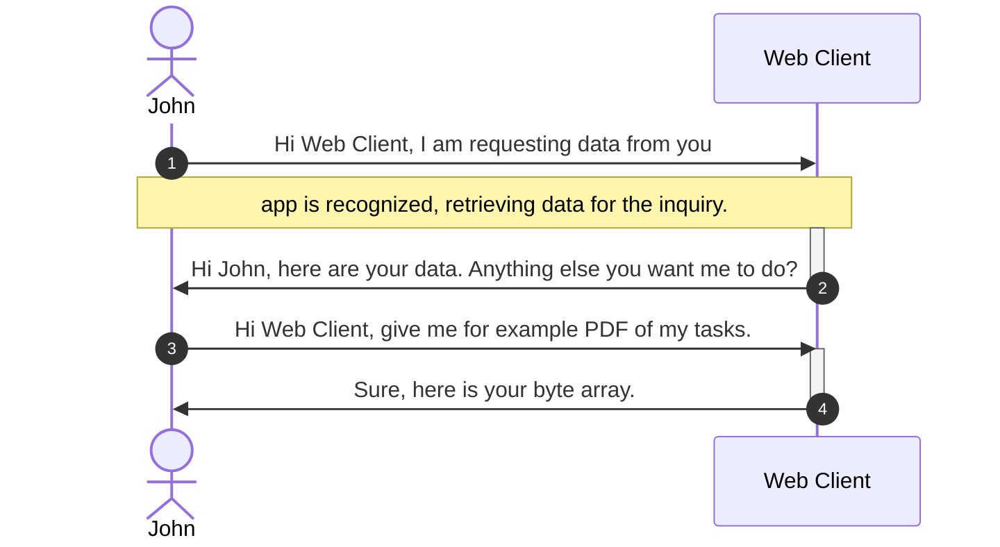

# Welcome to the Azure monitor automation workshop / What-The-Hack

<!-- TOC -->

* [Welcome to the Azure monitor automation workshop / What-The-Hack](#welcome-to-the-azure-monitor-automation-workshop--what-the-hack)
    * [Diagrams overview](#diagrams-overview)
    * [Flow with web application:](#flow-with-web-application-)
* [Move to Azure](#move-to-azure)

<!-- TOC -->

What the hack structure initiative to enable partners to understand automation and monitoring options
in [Azure](https://portal.azure.com) through
different tools and mechanisms solving challenges, which will help them understand their application and workloads even
better and to solve common challenges with [automation](https://docs.microsoft.com/en-us/azure/automation/)
and [monitoring](https://docs.microsoft.com/en-us/azure/azure-monitor/overview), including:

1. Automating deployments and practicing DevOps principles going from on-premise to the cloud with modernization in mind
2. Detect and diagnose issues across applications and dependencies with Application Insights.
3. Correlate infrastructure issues with VM insights and Container insights.
4. Drill into your monitoring data with Log Analytics for troubleshooting and deep diagnostics.
5. Support operations at scale with automated actions.
6. Create visualizations with Azure dashboards and workbooks.
7. Collect data from monitored resources by using Azure Monitor Metrics.
8. Investigate change data for routine monitoring or for triaging incidents by using Change Analysis.

## Diagrams overview

In order to start with the hackathon, let us check architecture diagram and requirement from the company TTA.
Your job, if you decide to accept it, is to use best practices from Microsoft to deploy and manage the solution for the
TTA company.

We have the following application on-premise:

User can choose from various options to access functionalities, either web browser application or WPF application, which
connects to API backend via REST calls.

## Flow with web application:

Flow with client app:

# Move to Azure

The company decided to move to the cloud to take advantage of cloud features - scale, geo support and many more. They
decided to go first with lift and shift approach - in short as is now without any change
to code and structure.

[1. Step: Move to Azure](./01-move-to-IaaS-Azure.md)