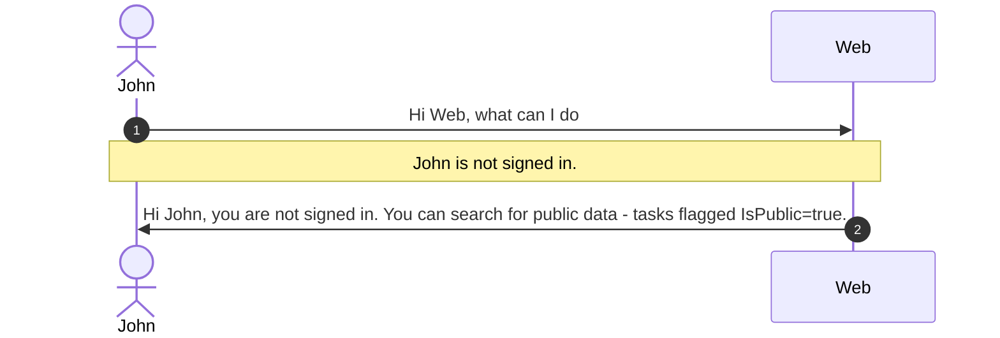
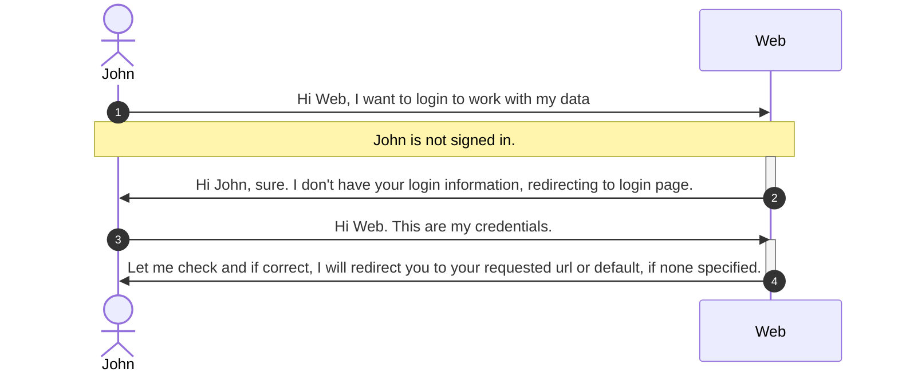
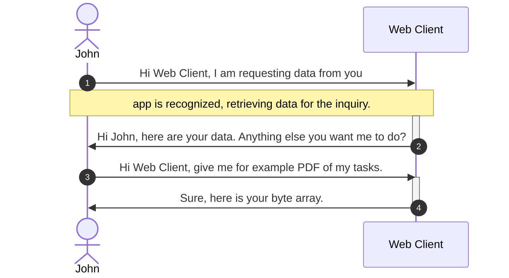

# Workload structure and technical details

<!-- TOC -->
* [Workload structure and technical details](#workload-structure-and-technical-details)
  * [Repository and code structure](#repository-and-code-structure)
    * [Source code - src folder](#source-code---src-folder)
    * [Containers overview](#containers-overview)
    * [Scripts folder overview](#scripts-folder-overview)
    * [Minimal requirements](#minimal-requirements)
* [Diagrams overview](#diagrams-overview)
  * [Populate data and prepare data backend](#populate-data-and-prepare-data-backend)
  * [Flow with web application](#flow-with-web-application)
  * [Flow with client app](#flow-with-client-app)
* [[OPTIONAL] Run the applications locally](#optional-run-the-applications-locally)
    * [Web App](#web-app)
    * [Web API](#web-api)
    * [WPF app](#wpf-app)
* [Helper links](#helper-links)
* [Let's start with first task - Move and automatic configuration in IaaS Azure](#lets-start-with-first-task---move-and-automatic-configuration-in-iaas-azure)
<!-- TOC -->

## Repository and code structure

Solution has 4 main folders:

1. **src** - solution source code based on C#, [ASP.NET](https://asp.net) Core, [htmx](https://htmx.org)
   , [Bootstrap](https://getbootstrap.com) and many more.
2. **scripts** - PowerShell scripts, ARM templates and Bicep language to automate deployments, multi-tenancy and
   monitoring
3. **docs** - documentation, architecture diagrams, videos and many more
4. **containers** - docker files to generate below applications for modernization options

### Source code - src folder

Solution is built out of 5 main parts:


1. **TTA.Web** - web client to manage tasks, see public open tasks, register into the system, view statistics and work
   with your tasks
2. **TTA.Web.ClientApi** - REST api to expose services to get tasks and operate on them
3. Clients applications
    - **TTA.Client.Win** - Windows client to check tasks, complete them and add comments and to simulate comments
    - **TTA.DataGenerator.SQL** - console application to recreate database and populate data
4. **TTA.StatGenerator** - worker service to calculate stats and populate data daily
5. **TTA.SQL** - MS SQL data storage implementation

All other projects are meant for helpers and for core infrastructure needs for application to be able to work.

1. **TTA.Core** - helpful classes to generate password hash, extensions for strings and so more
2. **TTA.Interfaces** - interfaces to be used in the application
3. **TTA.Models** - models representing the solution

To compile and run the code you will need [.NET core installed](https://dot.net). To work with the source code, you have
multiple editors available ([Microsoft Visual Studio](https://visualstudio.com)
, [Microsoft Visual Studio Code with C#](https://code.visualstudio.com)
plugin, [Jetbrains Rider](https://jetbrains.com/rider) and more).

### Containers overview

To take advantage of modernization opportunity and make solution to be cloud native aware, below are the container
files:

1. [TTA.Web.dockerfile](../containers/TTA.Web.dockerfile) - instructions to compile and build container with web
   application
2. [TTA.Web.ClientApi.dockerfile](../containers/TTA.Web.ClientApi.dockerfile) - instructions to compile and build container
   containing REST APIs
3. [TTA.DataGenerator.SQL.dockerfile](../containers/TTA.DataGenerator.SQL.dockerfile) - container with generator to be used
   with container instances to generate SQL data
4. [TTA.StatGenerator](../containers/TTA.StatGenerator.dockerfile) - background process as container to generate stats
   based on [cron](https://en.wikipedia.org/wiki/Cron) expression definition

You can leverage [Docker](https://docker.com), [Podman](https://podman.io)
or [Azure Container Registry to build](https://docs.microsoft.com/en-us/azure/container-registry/container-registry-tutorial-quick-task)
the containers.

To use Azure Container registry cloud build, you can execute following command from **src** folder (if you
have [az cli](https://docs.microsoft.com/en-us/cli/azure/install-azure-cli) installed):

`az acr build --image tta/web:1.0 --registry ##yourregistryname## --file ../containers/TTA.Web.dockerfile .`

`az acr build --image tta/webclient:1.0 --registry ##yourregistryname## --file ../containers/TTA.Web.ClientApi.dockerfile .`

`az acr build --image tta/statgen:1.0 --registry ##yourregistryname## --file ../containers/TTA.StatGenerator.dockerfile .`

`az acr build --image tta/datagen:1.0 --registry ##yourregistryname## --file ../containers/TTA.DataGenerator.SQL.dockerfile .`

### Scripts folder overview

Scripts contains folders with scripts for specific purposes in mixed languages (bash, pwsh, bicep, terraform,...).

For example: SQL folder contains scripts to create all tables or
separate table - depends on the need in specific.

Keep in mind - there are multiple ways to complete specific task and the idea is to learn new technology, not copy and
paste solutions.

### Minimal requirements

In order to deploy the application on your machine you will need:

1. [Dotnet SDK](https://dot.net)
2. [SQL server](https://www.microsoft.com/en-us/sql-server/sql-server-downloads) - LocalDB is sufficient
3. [PowerShell](https://docs.microsoft.com/en-us/powershell/scripting/install/installing-powershell?view=powershell-7.2)
    - latest and greatest is the best :)
3. (Optional)[Database Tools](https://www.microsoft.com/en-us/sql-server/sql-server-downloads) - navigate to bottom ot
   the page
4. (Optional)[Tools to work with Json](https://code.visualstudio.com)

**NOTE:**

If you install [IDE](https://en.wikipedia.org/wiki/Integrated_development_environment) (
f.e [Visual Studio](https://visualstudio.com),[JetBrains Rider](https://jetbrains.com/rider),...) you have all of those
tools already installed.

To work with Azure you'll need:

1. [Azure Subscription](https://azure.microsoft.com/en-us/free/)
2. [AZ CLI](https://docs.microsoft.com/en-us/cli/azure/install-azure-cli)

Check out
also [Scott Hanselman blog post about prettifying prompts](https://www.hanselman.com/blog/how-to-make-a-pretty-prompt-in-windows-terminal-with-powerline-nerd-fonts-cascadia-code-wsl-and-ohmyposh)
to make terminals pretty.

# Diagrams overview

In order to understand the workload let us check architecture diagram and requirement from the company TTA.
Your job, if you decide to accept it, is to use best practices from Microsoft to deploy and manage the solution for the
TTA company.

We have the following application on-premise:


User can choose from various options to access functionalities, either web browser application or WPF application, which
connects to API backend via REST calls.

## Populate data and prepare data backend

To start easier with the solution, development team built SQL generator, which generates database, tables, relationship
between them and makes sure to populate data.

To give you more options, you got following options as environment variables to control how to generate and populate
data:

| Parameters            | Description                                                                           | Is mandatory                               |
|-----------------------|---------------------------------------------------------------------------------------|--------------------------------------------|
| SQL_CONNECTION_STRING | connection string to the database or data server                                      | NO (it will use LocalDB by default)        |
| FOLDER_ROOT           | root path to this solution (git clone and give root path)                             | NO (if not provided, you will be prompted) |
| DROP_DATABASE         | flag true or false to drop database                                                   | NO (if not provided, you will be prompted) |
| CREATE_TABLES         | flag true or false to create table. You can false, if you want to just populate data. | NO (if not provided, you will be prompted) |
| DEFAULT_PASSWORD      | define password. Password will be hashed.                                             | NO (if not provided, you will be prompted) |
| RECORD_NUMBER         | define number of records to be inserted                                               | NO (if not provided, you will be prompted) |

Check [TTA.DataGenerator.SQL](../src/TTASLN/TTA.DataGenerator.SQL/Program.cs) for more details about automatic data
creation.


if you want you can download video in better quality, it is
available [here](https://webeudatastorage.blob.core.windows.net/files/maw-sql-generator.mp4).

To run the solution, navigate to the [folder in terminal](../src/TTASLN/TTA.DataGenerator.SQL/)) and run dotnet run

```
dotnet run
```

## Flow with web application

User navigates to the main web page on localhost. He opens preferred web browser, goes to **https://localhost/ttaweb**
and below
flow happens:



Since John is not logged in, he can see public data - something like this:


If he is logged in, he can then go to his dashboard, see his work tasks, comments, search through items, complete the,
download them as PDF, etc.




With clicking on the item details, you can see more information and an option to add comment and download as PDF.


## Flow with client app

Client app is already populated with ID in settings. If settings is not entered, then it takes current identity from
Windows. As we are testing functionalities, we will "fake" use access. Flow goes in many cases like this below:




# [OPTIONAL] Run the applications locally 

You need to have [pre-requisites](#minimal-requirements) for it to run properly.

### Web App

To run the web application, simply [navigate to web project](../src/TTASLN/TTA.Web) and run the project. To try out
working environment, you'll need:

1. **SQL connection string** - you will need to provide environment variable **SqlOptions__ConnectionString** or add
   connection
   string details in [appsettings.json](../src/TTASLN/TTA.Web/appsettings.json).
2. **Client API URL** - you will need to provide url in environment variable **AppOptions__ClientApiUrl** or add
   connection string details in [appsettings.json](../src/TTASLN/TTA.Web/appsettings.json).

and then run the app with

```
dotnet run
```

### Web API

To run the web api, navigate to that folder and
configure [appsettings.json](../src/TTASLN/TTA.Web.ClientApi/appsettings.json):

1. **SQL connection string** - you will need to provide environment variable **SqlOptions__ConnectionString** or add
   connection
   string details in [appsettings.json](../src/TTASLN/TTA.Web/appsettings.json).

and the run the app with

```
dotnet run
```

### WPF app

To run the WPF app, navigate to that folder and configure [App.config](../src/TTASLN/TTA.Client.Win/App.config):

1. **ClientWebApiUrl** - URL to client API
2. **LoggedUserId** - user id to mimic username

and then run the app with

```
dotnet run
```

You can play around with workload to see all of the features. 

# Helper links

To help with installation, few links to check out:
1. [PowerShell](https://docs.microsoft.com/en-us/powershell/)
2. [DotNet](https://dot.net)
3. [AZ CLI](https://docs.microsoft.com/en-us/cli/azure/)
4. [Visual Studio](https://visualstudio.com)
5. [Visual Studio Code](https://code.visualstudio.com)
6. [PowerShell for Visual Studio](https://code.visualstudio.com/docs/languages/powershell)
7. [Windows Terminal](https://docs.microsoft.com/en-us/windows/terminal/install)

# Let's start with first task - Move and automatic configuration in IaaS Azure

The company decided to move to the cloud to take advantage of cloud features - scale, geo support and many more. They
decided to go first with lift and shift approach - in short as is now without any change to code and structure.

[1. Step: Move to Azure](./01-move-to-IaaS-Azure.md)

