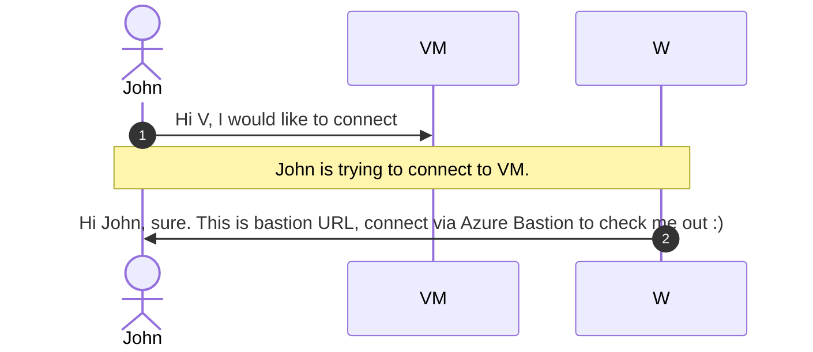

# Scale solution out

<!-- TOC -->
* [Scale solution out](#scale-solution-out)
  * [Diagram](#diagram)
  * [Requirements](#requirements)
  * [Test the functionality](#test-the-functionality)
* [Helper links](#helper-links)
* [Modernization in the wind of change](#modernization-in-the-wind-of-change)
<!-- TOC -->

CTO is satisfied with result. After getting many traffic on the solution (and users complaining), he wants to scale out
and add resources to handle the traffic. He wants for traffic to be equally distributed and data stored in one database
for the ease of administration and control. His data team decided to move it to Azure SQL database for Azure to manage
the balancing of resources.

To prevent accidental accesses to the VM, VM needs to be private and only app is accessible from internet. If there is a
need to connect to VM, Azure Bastion should be enabled.



## Diagram

After discussing with his council, he decided to take it step by step, moving different parts out and putting solution
in front of load balancer. To accomodate the need to add resources automatically, he decided to automate the creation of
adding new resources to the mix.


## Requirements

Based on the diagram above, to support automated scripts for deployment or DevOps, your job is to create:

1. resource creation automation
2. modification and adjusting configuration to support the change
3. migration of existing data to newly created resource (Azure SQL Basic DTU is enough for the requirement)
4. configure health probe to know if web and web REST client app is alive (ttaweb/health and ttawebclient/health to get
   back the result)
5. Load-balancing equally between multiple available resources
6. Modify changes to the application to use newly created resources
7. Check if the solution works after the change and if it redirects to different machine equally

**Bonus**: create a DevOps pipeline to add stuff via pipeline after doing a change in script.

## Test the functionality

Open a browser and navigate to that website and test functionality.

You can also use PowerShell to open webpage with default browser like this:

``` powershell
Start-Process https://[FQDN]
```

Test out both website and rest client so that they work. Run the test below to see, if random results.


# Helper links

To help you with this quest, check out this resources:

1. [Azure SQL DTU](https://docs.microsoft.com/en-us/azure/azure-sql/database/service-tiers-dtu?view=azuresql)
2. [Azure Load Balancer](https://docs.microsoft.com/en-us/azure/load-balancer/concepts)
3. [Azure Load Testing](https://docs.microsoft.com/en-us/azure/load-testing/quickstart-create-and-run-load-test)

# Modernization in the wind of change

Solution has grown quite a bit and customer are requiring new functionalities / special requirements to suit their
needs and to scale independently. To accomodate such requests, CTO decided to move application to containers and with
that we can easily scale components independently.

[<< Move to IaaS](./01-move-to-IaaS-Azure.md) | [Modernization approach >>](./03-modernization-in-Azure.md)